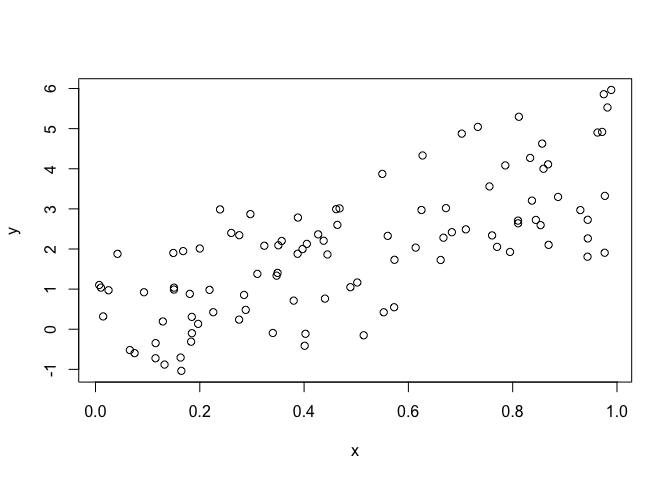
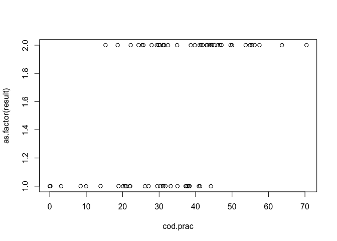
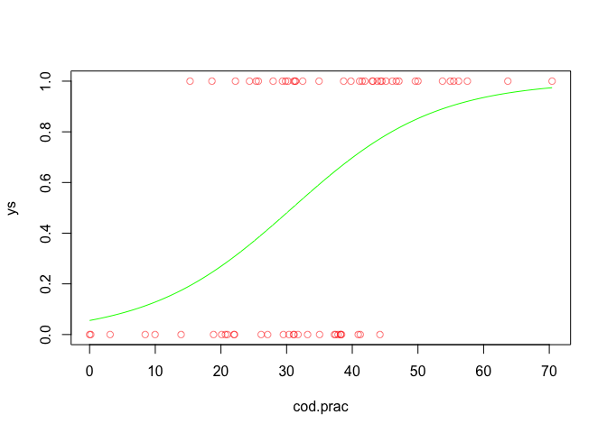

Likelihood-AIC
================
Sean Chien
2022-11-02

Likelihood and AIC Model Selection

First, we need to understand what model selection is. Model selection is
a process that to choose one of the models which addresses the problem
the best.

Likelihood is the probability of a dataset given a model. Higher the
better. Its range is between 0 and 1.

AIC(Akaike information criterion)

𝐴𝐼𝐶 = 2𝑘 − 2ln(𝐿)  
k = number of parameters  
ln(L) log likelihood of the data (a big negative number)

Adding additional predictor variables will always improve the fit of the
data under the model.

R example:

``` r
set.seed(2)
x <- runif(100)
y <- rnorm(100, mean = 4*x)
z <- runif(100)
```

<!-- -->

``` r
fit<-glm(y~x)
fit2<-glm(y~x+z)
```

``` r
summary(fit)
```

    ## 
    ## Call:
    ## glm(formula = y ~ x)
    ## 
    ## Deviance Residuals: 
    ##      Min        1Q    Median        3Q       Max  
    ## -2.23077  -0.85411   0.01703   0.92985   2.09850  
    ## 
    ## Coefficients:
    ##             Estimate Std. Error t value Pr(>|t|)    
    ## (Intercept)  0.04932    0.21727   0.227    0.821    
    ## x            3.94852    0.37828  10.438   <2e-16 ***
    ## ---
    ## Signif. codes:  0 '***' 0.001 '**' 0.01 '*' 0.05 '.' 0.1 ' ' 1
    ## 
    ## (Dispersion parameter for gaussian family taken to be 1.262504)
    ## 
    ##     Null deviance: 261.28  on 99  degrees of freedom
    ## Residual deviance: 123.73  on 98  degrees of freedom
    ## AIC: 311.08
    ## 
    ## Number of Fisher Scoring iterations: 2

``` r
summary(fit2)
```

    ## 
    ## Call:
    ## glm(formula = y ~ x + z)
    ## 
    ## Deviance Residuals: 
    ##      Min        1Q    Median        3Q       Max  
    ## -2.04788  -0.80474  -0.07834   0.83902   2.04717  
    ## 
    ## Coefficients:
    ##             Estimate Std. Error t value Pr(>|t|)    
    ## (Intercept)  -0.1582     0.2579  -0.614    0.541    
    ## x             3.8737     0.3795  10.208   <2e-16 ***
    ## z             0.5459     0.3706   1.473    0.144    
    ## ---
    ## Signif. codes:  0 '***' 0.001 '**' 0.01 '*' 0.05 '.' 0.1 ' ' 1
    ## 
    ## (Dispersion parameter for gaussian family taken to be 1.247619)
    ## 
    ##     Null deviance: 261.28  on 99  degrees of freedom
    ## Residual deviance: 121.02  on 97  degrees of freedom
    ## AIC: 310.87
    ## 
    ## Number of Fisher Scoring iterations: 2

Then, we can do log-likelihood

``` r
logLik(fit)
```

    ## 'log Lik.' -152.5386 (df=3)

``` r
logLik(fit2)
```

    ## 'log Lik.' -151.4327 (df=4)

Through those two results, we can observe two things

1.  The model 2 (fit2) has a lower AIC, so it has better fit.  
2.  The model 2 (fit2)’s log-likelihood is closer to 0, it has better
    fit

Also, because the model 2 has a better fit, it improves the predictor
variables

Run anova table to compute analysis of variance (or deviance)

``` r
anova(fit, fit2, test = "LRT")
```

    ## Analysis of Deviance Table
    ## 
    ## Model 1: y ~ x
    ## Model 2: y ~ x + z
    ##   Resid. Df Resid. Dev Df Deviance Pr(>Chi)
    ## 1        98     123.72                     
    ## 2        97     121.02  1   2.7064   0.1408

The residual deviance is how well the response variable can be predicted
by a model with predictor variables.  
The lower the value, the better the model is able to predict the value
of the response variable.

We cna try to run more complex model and see if they can improve the the
predictor variables

``` r
y2 <- rnorm(100, mean=3*x+z)
fit3 <- glm(y2 ~ x)
fit4 <- glm(y2 ~ x + z)
```

``` r
summary(fit3)
```

    ## 
    ## Call:
    ## glm(formula = y2 ~ x)
    ## 
    ## Deviance Residuals: 
    ##     Min       1Q   Median       3Q      Max  
    ## -2.4593  -0.6400  -0.0830   0.6321   3.1791  
    ## 
    ## Coefficients:
    ##             Estimate Std. Error t value Pr(>|t|)    
    ## (Intercept)   0.5197     0.2074   2.506   0.0139 *  
    ## x             3.1441     0.3611   8.708 7.65e-14 ***
    ## ---
    ## Signif. codes:  0 '***' 0.001 '**' 0.01 '*' 0.05 '.' 0.1 ' ' 1
    ## 
    ## (Dispersion parameter for gaussian family taken to be 1.150142)
    ## 
    ##     Null deviance: 199.93  on 99  degrees of freedom
    ## Residual deviance: 112.71  on 98  degrees of freedom
    ## AIC: 301.76
    ## 
    ## Number of Fisher Scoring iterations: 2

``` r
summary(fit4)
```

    ## 
    ## Call:
    ## glm(formula = y2 ~ x + z)
    ## 
    ## Deviance Residuals: 
    ##      Min        1Q    Median        3Q       Max  
    ## -2.68798  -0.60893  -0.09013   0.62783   2.90916  
    ## 
    ## Coefficients:
    ##             Estimate Std. Error t value Pr(>|t|)    
    ## (Intercept)   0.2823     0.2449   1.152   0.2520    
    ## x             3.0585     0.3604   8.486 2.46e-13 ***
    ## z             0.6245     0.3520   1.774   0.0792 .  
    ## ---
    ## Signif. codes:  0 '***' 0.001 '**' 0.01 '*' 0.05 '.' 0.1 ' ' 1
    ## 
    ## (Dispersion parameter for gaussian family taken to be 1.125482)
    ## 
    ##     Null deviance: 199.93  on 99  degrees of freedom
    ## Residual deviance: 109.17  on 97  degrees of freedom
    ## AIC: 300.56
    ## 
    ## Number of Fisher Scoring iterations: 2

``` r
anova(fit3, fit4, test="LRT")
```

    ## Analysis of Deviance Table
    ## 
    ## Model 1: y2 ~ x
    ## Model 2: y2 ~ x + z
    ##   Resid. Df Resid. Dev Df Deviance Pr(>Chi)  
    ## 1        98     112.71                       
    ## 2        97     109.17  1   3.5422  0.07606 .
    ## ---
    ## Signif. codes:  0 '***' 0.001 '**' 0.01 '*' 0.05 '.' 0.1 ' ' 1

``` r
logLik(fit3)
```

    ## 'log Lik.' -147.878 (df=3)

``` r
logLik(fit4)
```

    ## 'log Lik.' -146.2814 (df=4)

### Logistic Regression

Logistic regression is a process of modeling the probability of a
discrete outcome given an input variable.

R example

First, we simulate a data set for 68 student’s study time. If the time
is negative, we set it to 0.

``` r
set.seed(1)
cod.prac <- rnorm(68, mean=32, sd=16)
cod.prac[cod.prac<0] <- 0
```

Create a empty vector store the results. lets create a vector of prob of
passes by dividing the amount practiced by 60. (You can say if you study
more hours, your passing probability is higher.)

``` r
result <- c()
probs.pass <- cod.prac/60
```

Stimulate pass and fail data by a loop (Each time, we sample p(pass) or
f(fail), the probability here is a vector of probability weights for
obtaining the elements of the vector being sampled.)

So, this code you can explain in this way: Every time we sample a p or
f, the prob (weight, it should have two vector, one for p, another one
for f) will be (prob.pass for p; max(probs.pass)-probs.pass for f \>
this mean if you study more, you have higher pass rate and lower fail
rate)

``` r
for(i in 1:68){
  result[i] <- sample(c("p","f"),1,prob=c(probs.pass[i],max(probs.pass)-probs.pass[i]))
}
```

Then, you plot the result.

<!-- -->

Do logistic regression

``` r
fit <- glm(as.factor(result) ~ cod.prac, family = binomial)
```

We also can create a new data for logistic regression.  
The reason we create and predict a newdata for that, because our
response is binary(p/f) and the outcome will only 2 results. Explanation
for these code: creating a data frame with 1000 data that cod.practice
between 0 to maximum time. Then, using the predict function to create
the result(probability of passing)

``` r
newdat <- data.frame(cod.prac=seq(0, max(cod.prac), length.out=1000))
newdat$result <- predict(fit, newdata = newdat, type="response")
```

ys is to set the result for 68 students (p or f) to numeric,0 or 1. 0
for f and 1 for p.

``` r
ys <- as.numeric(as.factor(result))-1
```

Let’s plot the results.

``` r
plot(ys~cod.prac,col=rgb(1,0,0,.5) )
lines(newdat$result~newdat$cod.prac, col = "green")
```

<!-- -->

Calculate how much time we should study to pass the exam.

``` r
newdat$cod.prac[min(which(newdat$result > .5))]
```

    ## [1] 30.94791
